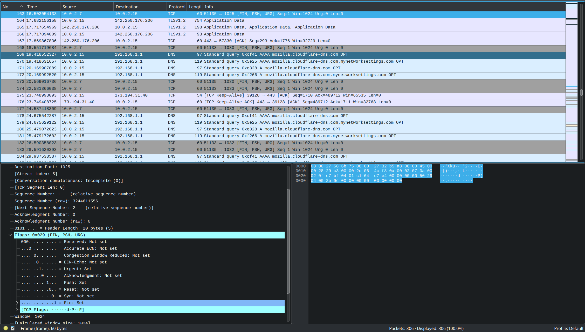
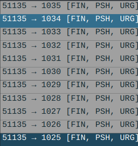

# netrunner-detected

> The netrunners were detected in our network. They used LOTL tactics and utilized `nmap` but we don't know what the traffic means or what their ultimate goal was. Can you replicate the `nmap` scan based off the captured traffic?
>
> Flag Format: order the arguments in alphabetical order, left to right, case sensitive, seperate by underscores. Example: `jctf{nmap_--arg1_--arg2_var_ip}`

Looking through the pcap file, we see some interesting traffic highlighted in grey


Looking at a single packet, we see the `FIN`, `PSH`, and `URG` bits set



This looks like an [Xmas attack](https://nmap.org/book/scan-methods-null-fin-xmas-scan.html)

>These three scan types... exploit a subtle loophole in the [TCP RFC](http://www.rfc-editor.org/rfc/rfc793.txt) to differentiate between `open` and `closed` ports. Page 65 of RFC 793 says that “if the destination port state is CLOSED .... an incoming segment not containing a RST causes a RST to be sent in response.” Then the next page discusses packets sent to open ports without the SYN, RST, or ACK bits set, stating that: “you are unlikely to get here, but if you do, drop the segment, and return.”
>
> When scanning systems compliant with this RFC text, any packet not containing SYN, RST, or ACK bits will result in a returned RST if the port is closed and no response at all if the port is open. As long as none of those three bits are included, any combination of the other three (FIN, PSH, and URG) are OK. Nmap exploits this with three scan types:
> 
> Null scan (-sN)
> 	Does not set any bits (TCP flag header is 0)
> 
> FIN scan (-sF)
> 	Sets just the TCP FIN bit.
> 
> Xmas scan (-sX)
> 	Sets the FIN, PSH, and URG flags, lighting the packet up like a Christmas tree.
> 	
> The key advantage to these scan types is that they can sneak through certain non-stateful firewalls and packet filtering routers. Such firewalls try to prevent incoming TCP connections (while allowing outbound ones) by blocking any TCP packets with the SYN bit set and ACK cleared. This configuration is common enough that the Linux iptables firewall command offers a special --syn option to implement it. The NULL, FIN, and Xmas scans clear the SYN bit and thus fly right through those rules.
>
> -- https://nmap.org/book/scan-methods-null-fin-xmas-scan.html

Filtering the packets with `tcp && ip.addr == 10.0.2.7 && ip.addr == 10.0.2.15` we see


The port range is between 1025 and 1035



Setting the initial packet as a timing reference, the attack seems to have a delay of 2 seconds between each packet.


```
nmap --help | grep Xmas  
 -sN/sF/sX: TCP Null, FIN, and Xmas scans
```

So the final command would be something like 

```
nmap -p1025-1035 --scan-delay 2s -sX 10.0.2.15
```

Translating it into the flag format, we get

> Flag Format: order the arguments in alphabetical order, left to right, case sensitive, separate by underscores. Example: `jctf{nmap_--arg1_--arg2_var_ip}`

```
jctf{nmap_-p1025-1035_--scan-delay_2s_-sX_10.0.2.15}
```

