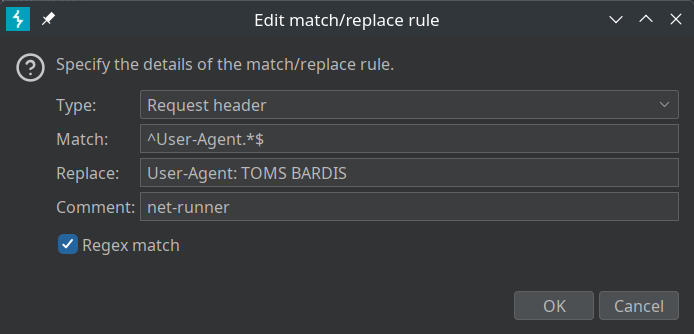

# runner-net

>Great work cracking that pcap file! I think we saw some interesting traffic, and we were definitely onto something with Dr Tom's blog. Unfortunately - security seems tight.
>
>But fortunately for us - people are the weakest link and some people might still be celebrating st. paddy's based on this network capture we grabbed. Check it out and see if they slipped up anywhere. It might be helpful to cross compare the old one, while you're at it.
>
>I can't help but think there's more than that. Mary and Maya said they found a way in, but typical them - they're MIA. Probably back dancing the night away again.
>**Flag format:** Exactly as it appears, which will be in the format `jctf{some_text}`.

Looking through the entire [pcap file](https://en.wikipedia.org/wiki/Pcap), there's a lot of traffic (27718 packets), and a lot of different types of traffic: [TCP](https://en.wikipedia.org/wiki/Transmission_Control_Protocol), [QUIC](https://en.wikipedia.org/wiki/QUIC), [TLS 1.3](https://en.wikipedia.org/wiki/Transport_Layer_Security), so we should filter based on something we know.

The challenge description talks about Dr Tom's blog, which from an earlier challenge we know is: https://drtomlei.xyz. A quick ping tells us its IP is:

```
$ ping drtomlei.xyz
PING drtomlei.xyz (54.163.212.148) 56(84) bytes of data.
```

Setting the filter `http && ip.addr == 54.163.212.148` gives us only 4 packets:


Just from the header we can see the url `/__/__tomsbackdoor` which looks interesting.

Inspecting another packet closer, we see the [User Agent](https://developer.mozilla.org/en-US/docs/Web/HTTP/Headers/User-Agent) being set to `TOMS BARDIS`.


Using [Burpsuite](https://portswigger.net/burp), we can set that as our User Agent. Then we are able to go to the `/__/__tomsbackdoor` page.


Since we will be making quite a few requests, lets set up an automatic User Agent match and replace.

Navigate to Proxy -> Proxy Settings -> Match and Replace


Add a new rule



Make sure it is enabled.


Clicking any link on the forum, we see that an `accessCode` cookie has been set and our User Agent re-write is working.

(The `accessCode` cookie came from visiting `/__/__tomsbackdoor` with the correct User Agent.)


The match and replace makes browsing the site much easier. (There are browser extensions that let you do this, but they are all sketchy.)

At this point we can turn burp interception off and just look around.

From the challenge description, we see the user `m_and_m` (probably Mary and Maya). 


Clicking on their profile and viewing it's source, we see


```
jctf{oh_no!_th3y_4r3_0n_t0_0ur_h3ad3r5!}
```
